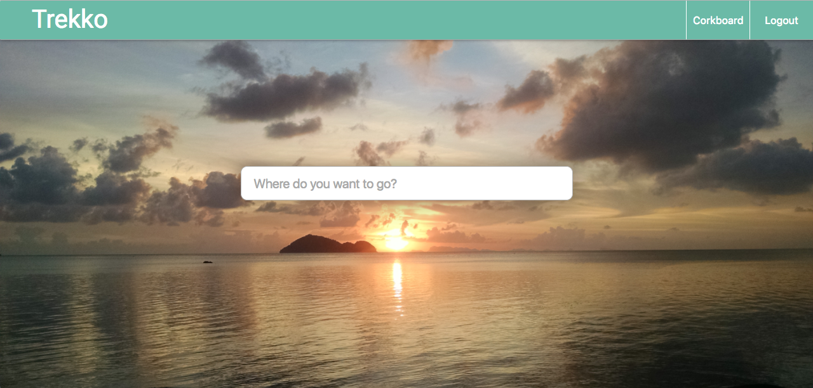
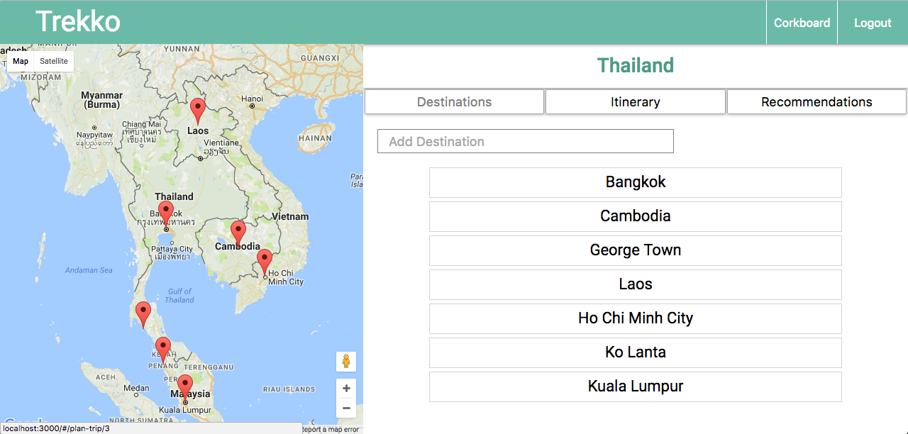

# Trekko

# IN DEVELOPMENT

[live][heroku]

[heroku]: https://trekko.herokuapp.com/

This is a travel site for planning your next vacation

Trekko is built with React + Redux on the front-end and a
Ruby on Rails server on the backend.

Uses the Google Maps and Google Places API for providing
an interactive trip planning experience for users.

Also employs facebook oauth and custom methods for authentication.

